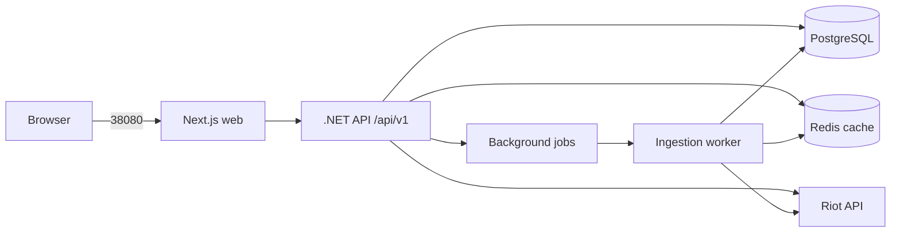

# Arquitectura

Última actualización: 2026-08-30

> Estado: Sprint 1 y Sprint 2 implementados; encuentros/relaciones, grafo y jobs persistentes permanecen planificados.

## Contexto

LoL Network Analyzer es una aplicación de análisis histórico, no una herramienta para revelar información de partidas activas. Recibe un Riot ID visible, resuelve su PUUID y procesa partidas finalizadas para construir encuentros y relaciones reutilizables.

## Vista de contenedores implementada



Solo Next.js se publica al host. API, worker, PostgreSQL y Redis permanecen en la red privada. Sprint 2 usa sincronización API acotada a 20 partidas; los jobs persistentes y la exclusión concurrente global se resuelven en Sprint 6.

## Monorepo implementado

```text
apps/
  web/                       Next.js, TypeScript, Tailwind
  api/
    src/
      LolAnalyzer.Api/
      LolAnalyzer.Application/
      LolAnalyzer.Domain/
      LolAnalyzer.Infrastructure/
    tests/
      LolAnalyzer.UnitTests/
      LolAnalyzer.IntegrationTests/
workers/
  ingestion-worker/
infrastructure/
  docker/
  aws/                       reservado; sin recursos obligatorios en MVP
docs/
scripts/
docker-compose.yml
```

## Flujo de datos

1. El usuario introduce `GameName#TagLine` y una región de plataforma.
2. API resuelve el PUUID mediante ACCOUNT-V1 usando el routing regional correcto.
3. La operación acotada obtiene IDs de MATCH-V5 con concurrencia configurable entre 1 y 5.
4. Cada match se busca por ID en PostgreSQL antes de llamar a Riot.
5. Los faltantes se guardan como JSONB y se normalizan en jugadores, partidas y participantes.
6. Procesos derivados reconstruyen encuentros; relaciones, grupos y grafo pertenecen a sprints posteriores.
7. El frontend consulta el progreso y resultados solo mediante `/api/v1`.

## Dependencias e invariantes

- PostgreSQL es fuente de verdad; Redis acelera pero no reemplaza persistencia.
- `players.puuid` y `matches.riot_match_id` son únicos.
- Una pareja de relaciones se normaliza como `player_a_id < player_b_id`.
- Las llamadas a Riot usan cliente abstraído, timeout, cancelación, backoff y control de `429`.
- Logs estructurados nunca incluyen la Riot API key, cuerpos sensibles ni identificadores innecesarios.
- CI usa HTTP simulado y no consume Riot.
- Imágenes objetivo: `linux/arm64` y `linux/amd64`.

## Despliegue previsto

El runtime privado actual es Docker Compose, con volúmenes persistentes y health checks de web, API, worker, PostgreSQL y Redis. PostgreSQL 18 monta su volumen en `/var/lib/postgresql`; las aplicaciones corren no-root. Cloudflare Tunnel/Nginx, publicación web y AWS se incorporarán solo cuando el alcance correspondiente sea aprobado y validado.
